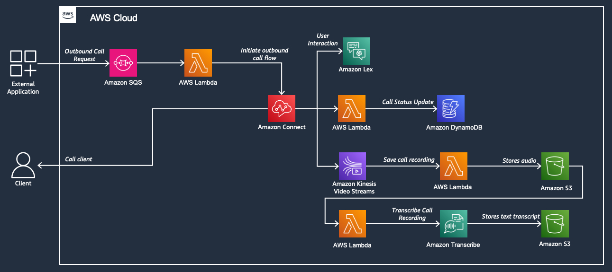

# Amazon Connect Outbound Call

This repository contains solutions that demonstrate how to integrate Amazon Connect with AWS Lambda, Amazon LEX and Amazon Transcribe to automatically initiate a call to customer, gather necessary information through a conversation and store both the audio and transciption of the call for future needs

## Architecture



## Tool Versions

To build and deploy this prototype the following tools are required.

1. npm >= 18
1. Python3 >= 3.12

## Prerequisites

### Lambda Layer Creation

The lambda functions in this samples require some packages that will be imported via lambda layers. Before we deploy the application, a zip must be generated that has all the necessary packages.

[Lambda Layer Creation Instruction](lambdas-layer/README.MD)

## Build and Deploy

### Build Web Application

```
cd web-app
npm install
npm run build
```

### Deploy

To deploy the code, run:

```
cd amazon-connect-outbound-call-cdk
cdk deploy --all
```

### Destroy

To clean up the environment, run:

```
cdk destory --all
```
