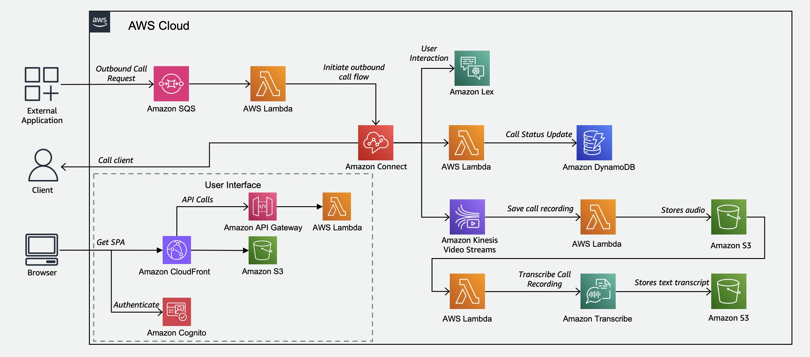

# Amazon Connect Outbound Call

This repository contains solutions that demonstrate how to integrate Amazon Connect with AWS Lambda, Amazon LEX and Amazon Transcribe to automatically initiate a call to customer, gather necessary information through a conversation and store both the audio and transciption of the call for future needs

## Architecture



## Tool Versions

To build and deploy this prototype the following tools are required.

1. npm >= 18
1. Python3 >= 3.12

## Prerequisites

### Lambda Layer Creation

The lambda functions in this samples require some packages that will be imported via lambda layers. Before we deploy the application, a zip must be generated that has all the necessary packages.

#### Lambda Layer for FFMPEG

This lambda layer is required to read KVM Stream from Kinesis Video Stream.

Run each of the following commands in the terminal one by one.

Go to the utils layer folder

```
cd lambdas-layer
```

Download the FFmpeg Static Builds

```
wget https://johnvansickle.com/ffmpeg/releases/ffmpeg-release-amd64-static.tar.xz
```

Validate the Check Sum of the download

```
wget https://johnvansickle.com/ffmpeg/releases/ffmpeg-release-amd64-static.tar.xz.md5
md5sum -c ffmpeg-release-amd64-static.tar.xz.md5
```

Extract the FFmpeg and build the lambda layer

```
tar xvf ffmpeg-release-amd64-static.tar.xz
mkdir -p ffmpeg/bin
cp ffmpeg-*-amd64-static/ffmpeg ffmpeg/bin/
cd ffmpeg
zip -9 -r ../ffmpeg.zip .
```

#### Lambda Layer for 3rd Party Python Library

Go to the utils layer folder

```
cd lambdas-layer
```

Create directory structure for Python Libraries

```
mkdir -p python/lib/python3.12/site-packages/
```

Install the required third party library

```
pip install -r requirements.txt -t python/lib/python3.12/site-packages/
```

zip the packages with

```
zip -r third-party-layer.zip python
```

## Build and Deploy

### Build Web Application

```
cd web-app
npm install
npm run build
```

### Deploy

To deploy the code, run:

```
cd amazon-connect-outbound-call-cdk
cdk deploy --all
```

### Destroy

To clean up the environment, run:

```
cdk destory --all
```
